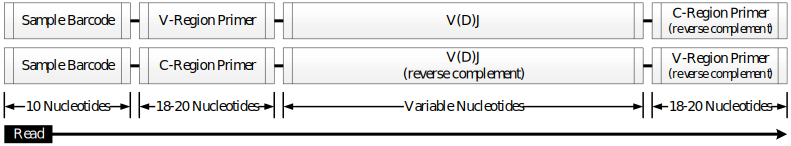
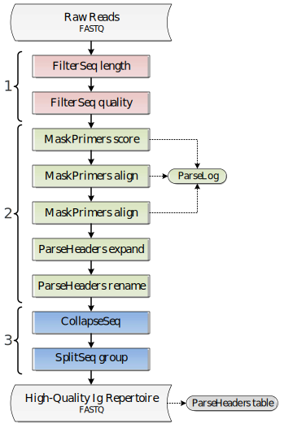

Roche 454 B cell receptor gDNA with sample barcoding
================================================================================

Overview of Experimental Data
--------------------------------------------------------------------------------

The following example uses the publicly available data from:

    | **Lineage structure of the human antibody repertoire in response to
      influenza vaccination.**
    | Jiang N, He J, and Weinstein JA, et al.
    | *Sci Transl Med. 2013 Feb 6;5(171):171ra19. doi:10.1126/scitranslmed.3004794.*

Which may be downloaded from the NCBI Sequence Read Archive under
accession ID: SRX190717. Primer and sample barcode (referred to as MID
in Jiang et al, 2013) sequences are available in the published
manuscript. This example assumes that the sample barcodes, forward
primers (V-region), and reverse primers (C-region) have been extracted
from the manuscript and placed into three corresponding FASTA files.
Reads must first be converted to FASTQ format, using a tool such as the
SRA Toolkit, before processing with pRESTO. A schematic of the read
configuration is shown below.

    **Schematic of the Roche 454 read configuration.**
    The start of each sequences is labeled with the sample barcode.
    The following sequence may either be in the forward (top) orientation,
    proceeding 5' to 3' in the direction of the V(D)J reading frame, or the
    reverse complement orientation (bottom), proceeding in the opposite direction.

We have hosted a small subset of the data (Accession: SRR765688) on the
pRESTO website in FASTQ format, with accompanying primer and sample
barcode files. The example that follows performs all processing steps to
arrive at high-quality unique sequences using this example data set. The
workflow is derived into three high level tasks:

    1. Removal of low quality reads
    2. Identification of sample barcodes and primers.
    3. Filtering for duplicate sequences.

A graphical representation of the workflow along with the corresponding
sequence of pRESTO commands is shown below.

    **Flowchart of processing steps.**
    Each pRESTO tool is shown as a colored box. The workflow is divided into
    three primary tasks: (1) quality control, (2) sample barcode and primer
    identification, (3) filtering of the repertoire for duplicate sequences.
    Grey boxes indicate the initial and final data files. The intermediate
    files output by each tool are not shown for the sake of brevity.

.. highlight:: bash
.. code-block:: bash

    01> FilterSeq.py length -s SRR765688.fastq -n 300
    02> FilterSeq.py quality -s SRR765688*length-pass.fastq -q 20 --outname STEP1
    03> MaskPrimers.py score -s STEP1*quality-pass.fastq -p SRR765688_MID.fasta \
        --start 0 --mode cut --log MPMID.log
    04> MaskPrimers.py align -s STEP1*primers-pass.fastq -p SRX190717_VPrimers.fasta \
        --maxlen 50 --mode cut --log MPVPrimers.log
    05> MaskPrimers.py align -s STEP1*primers-pass_primers-pass.fastq
        -p SRX190717_CPrimers.fasta --maxlen 50 --revpr --skiprc --mode cut \
        --outname STEP2 --log MPCPrimers.log
    06> ParseLog.py -l *.log -f ID PRSTART PRIMER ERROR
    07> ParseHeaders.py expand -s STEP2_primers-pass.fastq -f PRIMER
    08> ParseHeaders.py rename -s STEP2*reheader.fastq -f PRIMER1 PRIMER2 PRIMER3 \
        -k MID VPRIMER CPRIMER --outname STEP3
    09> CollapseSeq.py -s STEP3_reheader.fastq -n 20 --inner --uf MID CPRIMER \
        --cf VPRIMER --act set
    10> SplitSeq.py group -s STEP3_collapse-unique.fastq -f DUPCOUNT --num 2
    11> ParseHeaders.py table -s STEP3*atleast-2.fastq \
        -f ID DUPCOUNT MID CPRIMER VPRIMER

Quality control of raw reads
--------------------------------------------------------------------------------

The initial stage of the workflow involves two executions of the
FilterSeq tool. First, the ``length`` subcommand is used to filter reads
which are too short to yield full V(D)J sequences using a liberal
minimum length requirement of 300bp (Line 01). Next,
the ``quality`` subcommand removes sequences having a mean Phred quality
score below 20 (Line 02).

Identification of sample barcodes and primers
--------------------------------------------------------------------------------

Following the initial filtering steps, additional filtering is performed
with three iterations of the MaskPrimers tool based upon the presence of
recognized sample barcode, forward primer, and reverse primer sequences.
As the orientation and position of the sample barcode is known, the
first pass through MaskPrimers uses the faster ``score`` subcommand which
requires a fixed start position (Line 03). The next
MaskPrimers task uses the ``align`` subcommand to identify both the start
position of the V-region primer and correct the orientation of the
sequence such that all reads are now oriented in the direction of the
V(D)J reading frame (Line 03), as determined by the
orientation of the V-region primer match. The final MaskPrimers task
locates the C-region primer, which is used for isotype assignment of
each read (Line 04). As all sequences are assumed to have been
properly oriented by the second MaskPrimers task, the additional
arguments ``--revpr`` and ``--skiprc`` are added to the third execution. The
``--revpr`` argument informs the tool that primers sequences should be
reverse complemented prior to alignment, and that a match should be
searched for (and cut from) the tail end of the sequence. The ``--skiprc``
argument tells the tool to align against only the forward sequence;
meaning, it will not check primer matches against the reverse complement
sequence and it will not reorient sequences. At this stage, a table of
primers and alignment error rates may be generated by executing ParseLog
on the log file of each MaskPrimers task (Line 05).

During each iteration of the MaskPrimers tool the ``PRIMER`` annotation
field was updated with an additional value, such that after three
iterations each sequences contains an annotation of the form::

    PRIMER=sample barcode,V-region primer,C-region primer

To simplify later analysis, the ParseHeaders tool is used to first
expand this single annotation into three separate annotations (``expand``
subcommand), which are then renaming to MID, VPRIMER, and CPRIMER for
the sake of clarity (``rename`` subcommand) (Lines 07-08).

Filtering duplicate sequences
--------------------------------------------------------------------------------

The final stage of the workflow involves two filtering steps to yield
unique sequences for each sample barcode. First, the set of unique
sequences is identified using the CollapseSeq tool, allowing for up to
20 interior N-valued positions (``-n 20 --inner`` arguments), and
requiring that all reads considered duplicated share the same isotype
and sample barcode tag (``--uf MID CPRIMER`` argument) (Line 09).
Additionally, the V-region primer annotations of
the set of duplicate reads are propagated into the annotation of each
retained unique sequence (``--cf VPRIMER --act set set`` arguments).
CollapseSeq stores the count of duplicate reads for each sequence in the
``DUPCOUNT`` annotation. Following duplicate removal, the data is subset
to only those unique sequence with at least two representative reads by
using the ``group`` subcommand of SplitSeq on the count field (``-f
DUPCOUNT`` argument) and specifying a numeric threshold (``--num 2``
argument) (Line 10). Finally, the annotations,
including duplicate read count (``DUPCOUNT``), sample barcode (``MID``),
isotype (``CPRIMER``) and V-region primer (``VPRIMER``), of the final
repertoire are then extracted from the sequence file into a
tab-delimited table using the ``table`` subcommand of ParseHeaders (Line 11).

Performance
--------------------------------------------------------------------------------

Example performance statistics for a comparable, but larger, 454
workflow are presented below. Performance was measured
on a 64-core system with 2.3GHz AMD Opteron(TM) 6276 processors and
512GB of RAM, with memory usage measured at peak utilization. The data
set contained 1,346,039 raw reads, and required matching of 11 sample
barcodes, 11 V-segment primers, and 5 constant region primers.

.. csv-table::
   :file: tables/454_Jiang2013_Performance.tab
   :delim: tab
   :header-rows: 1
   :widths: 10, 40, 20, 10, 10, 10