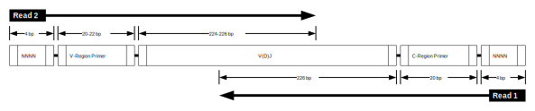

Illumina MiSeq 2x250 Stranded B cell receptor mRNA without UMIs
================================================================================

Overview of Experimental Data
--------------------------------------------------------------------------------

.. include:: ../../examples/Greiff2014/README.rst

Read Configuration
^^^^^^^^^^^^^^^^^^^^^^^^^^^^^^^^^^^^^^^^^^^^^^^^^^^^^^^^^^^^^^^^^^^^^^^^^^^^^^^^

    **Schematic of Illumina MiSeq 2x250 stranded paired-end reads without UMI barcodes.**
    Each 250 base-pair read was sequenced from one end of the target cDNA, so
    that the two reads together cover the entire variable region of the Ig
    heavy chain. The V(D)J reading frame proceeds from the start of read 2 to
    the start of read 1. Read 1 is in the opposite orientation
    (reverse complement), and contains the C-region primer sequence. Both
    reads begin with a random sequences of 4 nucleotides.

Example Data
^^^^^^^^^^^^^^^^^^^^^^^^^^^^^^^^^^^^^^^^^^^^^^^^^^^^^^^^^^^^^^^^^^^^^^^^^^^^^^^^

We have hosted a small subset of the data (Accession: ERR346600) on the
pRESTO website in FASTQ format, with accompanying primer files and an example
workflow script. The sample data set and workflow script may be downloaded from
here:

.. todo::

    `Greiff et al, 2014 example <http://clip.med.yale.edu/presto/examples/Example_Data_Greiff2014.zip>`__

Overview of the Workflow
--------------------------------------------------------------------------------

In the following sections, we demonstrate each step of the workflow to move
from raw sequence reads to a fully annotated repertoire of complete V(D)J
sequences. The workflow is divided into four high-level tasks:

    1. Assembly of paired-end reads.
    2. Quality control and annotation of primers.
    3. Removal of duplicate sequences.

A graphical representation of the workflow along with the corresponding
sequence of pRESTO commands is shown below.

Flowchart
^^^^^^^^^^^^^^^^^^^^^^^^^^^^^^^^^^^^^^^^^^^^^^^^^^^^^^^^^^^^^^^^^^^^^^^^^^^^^^^^

    **Flowchart of processing steps.**
    Each pRESTO tool is shown as a colored box. The workflow is divided into
    three primary tasks: (orange) asssembly of paired-end reads, (green)
    quality control and primer annotation, and removal of duplicate sequences
    (blue). The intermediate files output by each tool are not shown for the
    sake of brevity.

Commands
^^^^^^^^^^^^^^^^^^^^^^^^^^^^^^^^^^^^^^^^^^^^^^^^^^^^^^^^^^^^^^^^^^^^^^^^^^^^^^^^

.. literalinclude:: scripts/Greiff2014_Commands.sh
   :language: none
   :linenos:
   :lineno-match:

:download:`Download Commands <scripts/Greiff2014_Commands.sh>`

Assembly of paired-end reads
--------------------------------------------------------------------------------

Each set of paired-ends mate-pairs is first assembled into a full length Ig
sequence using the ``align`` subcommand of the :ref:`AssemblePairs tool`:

.. literalinclude:: scripts/Greiff2014_Commands.sh
   :language: none
   :lineno-match:
   :lines: 2-3

During assembly we have defined read 2 (V-region) as the head of the sequence
(``--1`` argument) and read 2 as tail of the sequence (``--2`` argument). The
``--coord`` argument defines the format of the sequence header so that
AssemblePairs can properly identify mate-pairs; in this case, we use
``--coord sra`` as out headers are in the SRA/ENA format.

.. note::

    For both the AssemblePairs and PairSeq commands using the correct
    ``--coord`` argument is critical for matching mate-pairs. The most
    common values to use are: ``sra``, ``illumina``, ``454`` and ``presto``.

The ParseLog tool:

 .. literalinclude:: scripts/Greiff2014_Commands.sh
   :language: none
   :lineno-match:
   :lines: 14

is used to build a tab-delimited table of results from the AssemblePairs
log file containing the following entries:

===================== ===============================
Field                 Description
===================== ===============================
ID                    Sequence name
LENGTH                Length of the assembled sequence
OVERLAP               Length of the overlap between mate-pairs
ERROR                 Mismatch rate of the overlapping region
PVALUE                P-value for the assembly
===================== ===============================

Quality control and annotation of raw reads
--------------------------------------------------------------------------------

Quality control begins with the identification and removal of
low-quality reads using the ``quality`` subcommand of the :ref:`FilterSeq` tool.
In this example, reads with mean Phred quality scores less than
20 are removed:

.. literalinclude:: scripts/Greiff2014_Commands.sh
   :language: none
   :lineno-match:
   :lines: 4

When dealing with Ig sequences, it is important to cut or mask the primers,
as B-cell receptors are subject to somatic hypermutation (the
accumulation of point mutations in the DNA) and degenerate primer
matches can look like mutations in downstream applications. The ``score``
subcommand of :ref:`MaskPrimers` is used to identify and remove the V-region and
C-region PCR primers for both reads:

.. literalinclude:: scripts/Greiff2014_Commands.sh
   :language: none
   :lineno-match:
   :lines: 5-8

In this data set the authors have added a random sequence of 4 bp to the
start of each read before the primer sequence to increase sequence diversity
and the reliability of cluster calling on the Illumina platform.
As such, both primers begin at position 4 (``--start 4``), but the C-region
primer beings 4 bases from the end of the assembled read. The addition of the
``--revpr`` argument to the second MaskPrimers step instructs the
tool to reverse complement the primer sequences and check the tail of the
read. The two primer regions have also been treated differently. The V-region
primer has been masked (replaced by Ns) using the ``--mode mask`` argument
to preserve the V(D)J length, while the C-region primer has been removed
from the sequence using the ``--mode cut`` argument.

.. note::

    This library was prepared in a stranded manner. Meaning, the read
    orientation is constant for all reads; read 1 is always the C-region
    end of the amplicon and read 2 is always the V-region end.  If your
    data is unstranded (50% of the reads are forward, 50% are reversed),
    then you must modify the first MaskPrimers step
    to account for this by using the ``align`` subcommand instead::

        MaskPrimers.py align -s M1*quality-pass.fastq -p Greiff2014_VPrimers.fasta \
            --mode mask --maxlen 30 --log MP1.log

    This will perform a slower process of aligning the primers, checking
    the reverse compliment of each read for matches, and correcting the
    the output sequences to the forward orientation (V to J).

To summarize these steps, the ParseLog tool is used to build tab-delimited
tables from the log files:

.. literalinclude:: scripts/Greiff2014_Commands.sh
   :language: none
   :lineno-match:
   :lines: 15-16

Containing the following information:

===================== ===============================
FilterSeq Field       Description
===================== ===============================
ID                    Sequence name
QUALITY               Quality score
===================== ===============================

===================== ===============================
MaskPrimers Field     Description
===================== ===============================
ID                    Sequence name
PRIMER                Primer name
ERROR                 Primer match error rate
===================== ===============================

Removal of duplicate sequences and filtering
--------------------------------------------------------------------------------

.. todo::

Performance
--------------------------------------------------------------------------------

.. todo::
