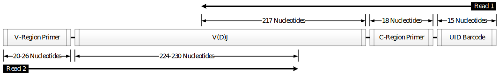

Illumina MiSeq 2x250 B cell receptor mRNA with UMI barcodes
================================================================================

Overview of Experimental Data
--------------------------------------------------------------------------------

The following example uses publicly available data from:

    | **B cells populating the multiple sclerosis brain mature in the draining
      cervical lymph nodes.**
    | Stern JNH, Yaari G, and Vander Heiden JA, et al.
    | *Sci Transl Med. 2014. 6(248):248ra107. doi:10.1126/scitranslmed.3008879.*

Which may be downloaded from the NCBI Sequence Read Archive under
BioProject accession ID: PRJNA248475. Primers sequences are available
online at the `supplemental website <http://clip.med.yale.edu/papers/Stern2014STM>`__
for the publication. Reads must first be converted to FASTQ format, using a tool
such as the SRA Toolkit, before processing with pRESTO. A schematic of the read
configuration is shown below.

    **Schematic of the Illumina MiSeq 2x250 paired-end reads with UMI barcodes.**
    Each 250 base-pair read was sequenced from one end of the target cDNA, so
    that the two reads together cover the entire variable region of the Ig
    heavy chain. The V(D)J reading frame proceeds from the start of read 2 to
    the start of read 1. Read 1 is in the opposite orientation
    (reverse complement), and contains a 15 nucleotide UMI barcode preceding
    the C-region primer sequence.

Example Data
--------------------------------------------------------------------------------

We have hosted a small subset of the data (Accession: SRR1383456) on the
pRESTO website in FASTQ format with accompanying primer files. The sample data
set and workflow script may be downloaded from here:
`Stern et al, 2014 example <http://clip.med.yale.edu/presto/examples/Example_Data_UID_Stern2014.zip>`__

Overview of the Workflow
--------------------------------------------------------------------------------

In the following sections, we demonstrate each step of the workflow to move
from raw sequence reads to a fully annotated repertoire of complete V(D)J
sequences. The workflow is divided into four high-level tasks:

    1. Quality control and annotation of raw reads.
    2. Generation of UMI consensus sequences.
    3. Assembly of paired-end reads.
    4. Filtering to obtain the high-fidelity repertoire.

A graphical representation of the workflow along with the corresponding
sequence of pRESTO commands is shown below.

Flowchart
^^^^^^^^^^^^^^^^^^^^^^^^^^^^^^^^^^^^^^^^^^^^^^^^^^^^^^^^^^^^^^^^^^^^^^^^^^^^^^^^

.. figure:: figures/MiSeq_Stern2014_Flowchart.svg
    :align: center

    **Flowchart of processing steps.**
    Each pRESTO tool is shown as a colored box. The workflow is divided into
    four primary tasks: (1) quality control and annotation of raw reads,
    (2) generation of UMI consensus sequences, (3) assembly of paired-end reads,
    and (4) filtering to obtain the high-fidelity repertoire. Grey boxes indicate
    the initial and final data files. The intermediate files output by each tool
    are not shown for the sake of brevity.

Commands
^^^^^^^^^^^^^^^^^^^^^^^^^^^^^^^^^^^^^^^^^^^^^^^^^^^^^^^^^^^^^^^^^^^^^^^^^^^^^^^^

.. literalinclude:: scripts/Stern2014_Commands.sh
   :language: none
   :linenos:
   :lines: 2-

:download:`Download Commands <scripts/Stern2014_Commands.sh>`

Quality control and annotation of raw reads
--------------------------------------------------------------------------------

Quality control begins with the identification and removal of
low-quality reads using the ``quality`` subcommand of the FilterSeq tool.
In this example, reads with mean Phred quality scores less than
20 (`Commands`_ 1-2) are removed. Next, the``score`` subcommand of MaskPrimers is
used to identify and remove the PCR primers for both reads (`Commands`_ 3-6). When
dealing with Ig sequences, it is important to cut or mask the primers,
as B-cell receptors are subject to somatic hypermutation (the
accumulation of point mutations in the DNA) and degenerate primer
matches can look like mutations in downstream applications. The
MaskPrimers tool is also used to annotate each read 1 sequence
with the 15 nucleotide UMI barcode that precedes the primer
(``--barcode`` argument).

To summarize these steps, the ParseLog tool is used to build a table of
sequence name (``ID``), primer identity (``PRIMER``), UMI barcode
(``BARCODE``), and primer match error rate (``ERROR``) from the MaskPrimers
log files (`Commands`_ 7).

Generation of UMI consensus sequences
--------------------------------------------------------------------------------

In this task, a single consensus sequence is constructed for each set of
reads annotated with the same UMI barcode. As the UMI barcode is part of
read 1, the ``BARCODE`` annotation identified by MaskPrimers must
first be copied to the read 2 mate-pair of each read 1
sequence. Propogation of annotations between mate pairs is performed
using PairSeq (`Commands`_ 8-9), which also removes
unpaired reads and ensures that paired reads are sorted in the same
order across files.

Before generating a consensus for a set of reads sharing a UMI barcode,
the sequences must be properly aligned. Sequences may not be aligned if
more than one PCR primer is identified in a UMI read group - leading to
variations in the the start positions of the reads. Ideally, each set of
reads originating from a single mRNA molecule should be amplified with
the same primer. However, different primers in the multiplex pool may be
incorporated into the same UMI read group during amplification if the
primers are sufficiently similar. This type of primer misalignment can
be corrected using the AlignSets tool. In the example data used here,
this step was not necessary due to the aligned primer design for the 45
V-region primers, though this does require that the V-region primers be
masked, rather than cut, during the MaskPrimers step (``--mode mask``
argument) (`Commands`_ 5-6).

After alignment, a single consensus sequence is generated for each UMI
barcode using BuildConsensus (`Commands`_ 10-13). To
correct for UMI chemistry and sequencing errors, UMI read groups having
high error statistics (mismatch rate from consensus) are removed by
specifiying the ``--maxerror 0.1`` threshold. As the accuracy of the
primer assignment in read 1 is critical for correct isotype
identification, additional filtering of read 1 is carried out
during this step. Specifying the ``--prcons 0.6`` threshold: (a) removes
individual sequences that do not share a common primer annotation with
the majority of the set, (b) removes entire read groups which have
ambiguous primer assignments, and (c) constructs a consensus primer
assignment for each UMI. A majority rule is used to delete any gap
positions which occur in more than 50% of the reads using the ``--maxgap
0.5`` argument.

Finally, the ParseLog tool is used to build a table of UMIs (``BARCODE``),
read counts (``CONSCOUNT``), read 1 consensus isotype primers
(``PRCONS``), and error statistics (``ERROR``) (`Commands`_ 14) from the
BuildConsensus log files.

Assembly of paired-end UMI consensus sequences
--------------------------------------------------------------------------------

Following UMI consensus generation, the read 1 and read 2 files may
again be out of sync due to differences in UMI read group filtering by
BuildConsensus. To synchronize the reads another instance of PairSeq
must be run, but without any annotation manipulation (`Commands`_  15-16).

Once the files have been synchronized, each paired-end UMI consensus
sequence is assembled into a full length Ig sequence by the
AssemblePairs tool (`Commands`_ 17-19). During assembly, the consensus isotype
annotation (``PRCONS``) from read 1 and the number of reads used to define
the consensus sequence (``CONSCOUNT`` annotation) for both reads are propagated
into the annotations of the full length Ig sequence.

The AssemblePairs log captures the overlap length (``OVERLAP``), error
rates (``ERROR``), and p-values (``PVALUE``) of each assembly operation.
These logs can be converted into a table using ParseLog to provide the
overlap distribution and assembly error rates (`Commands`_ 20).

Obtaining the high-fidelity repertoire
--------------------------------------------------------------------------------

In the final stage of the workflow, the high-fidelity Ig repertoire is
obtained by a series of filtering steps. First, the annotation
specifying the number of raw reads used to build each sequence is
updated to be the minimum of the forward and reverse reads using
ParseHeaders (`Commands`_ 21).

Second, duplicate nucleotide sequences are removed using the CollapseSeq
tool with the requirement that duplicate sequences share the same
isotype primer (``--uf PRCONS`` argument) (`Commands`_ 22-23). The duplicate removal
step also removes sequences with a high number of interior N-valued nucleotides
(``-n 20 --inner`` arguments) and combines the read counts for each UMI read
group (``--cf CONSCOUNT --act sum`` arguments).

Finally, unique sequences are filtered to those with at least 2
contributing sequences using the ``group`` subcommand of SplitSeq (`Commands`_ 24),
by splitting the file on the CONSCOUNT annotation with a numeric threshold
(``-f CONSCOUNT –num 2`` argument). For further analysis, the annotations of
the final repertoire are then converted to into a table using the ``table``
subcommand of ParseHeaders (`Commands`_ 25).

Performance
--------------------------------------------------------------------------------

Example performance statistics for a comparable, but larger, MiSeq
workflow are presented below. Performance was measured
on a 64-core system with 2.3GHz AMD Opteron(TM) 6276 processors and
512GB of RAM, with memory usage measured at peak utilization. The data
set contained 1,723,558 x 2 raw reads, and required
matching of 1 constant region primer, 45 V-segment
primers, and averaged 24.3 reads per UMI.

.. csv-table::
   :file: tables/MiSeq_Stern2014_Performance.tab
   :delim: tab
   :header-rows: 1
   :widths: 10, 40, 20, 10, 10, 10

