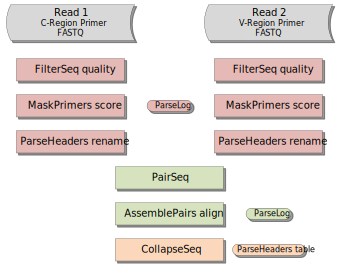

Illumina MiSeq 2x250bp B cell receptor mRNA without UMIs
================================================================================

Overview of Experimental Data
--------------------------------------------------------------------------------

The following example uses the publicly available data from:

    | **Diversity, cellular origin and autoreactivity of antibody-secreting cell
      population expansions in acute systemic lupus erythematosus.**
    | Tipton CM, et al.
    | *Nat. Immunol. 2015. 16(7):755-65. doi:10.1038/ni.3175*

Which may be downloaded from the NCBI Sequence Read Archive under
BioProject accession ID: PRJNA280743. Primers sequences are available
from the publication. Reads must first be converted to FASTQ format,
using a tool such as the SRA Toolkit, before processing with pRESTO.
A schematic of the read configuration is shown below.

.. todo::

    Graphic of Tipton et al, 2015 read configuration

Example Data
--------------------------------------------------------------------------------

We have hosted a small subset of the data (Accession: SRR1964798) on the
pRESTO website in FASTQ format with accompanying primer files. The sample data
set and workflow script may be downloaded from here:

.. todo::

    `Tipton et al, 2015 example <http://clip.med.yale.edu/presto/examples/Example_Data_Tipton2015.zip>`__

You may also retrieve the example data, the first 10,000 sequences of SRR1964798,
using the fastq-dump tool from the
`SRA Toolkit <http://www.ncbi.nlm.nih.gov/Traces/sra/sra.cgi?view=software>`__:

.. code-block:: bash

    fastq-dump --split-files -X 10000 SRR1964798

Overview of the Workflow
--------------------------------------------------------------------------------

In the following sections, we demonstrate each step of the workflow to move
from raw sequence reads to a fully annotated repertoire of complete V(D)J
sequences. The workflow is divided into four high-level tasks:

    1. Quality control and annotation of raw reads.
    2. Assembly of paired-end reads.
    3. Removal of duplicate sequences and filtering.

A graphical representation of the workflow along with the corresponding
sequence of pRESTO commands is shown below.

    **Flowchart of processing steps.**
    Each pRESTO tool is shown as a colored box. The workflow is divided into
    three primary tasks: (1) quality control and annotation of raw reads,
    (2) asssembly of paired-end reads, and (3) removal of duplicate sequences and filtering.
    The intermediate files output by each tool are not shown for the sake of brevity.

.. code-block:: shell
    :linenos:
    :caption: Commands

    ConvertHeaders.py sra -s SRR1964798_1.fastq --outname R1
    ConvertHeaders.py sra -s SRR1964798_2.fastq --outname R2
    FilterSeq.py quality -s R1.fastq -q 20
    FilterSeq.py quality -s R2.fastq -q 20
    MaskPrimers.py score -s R1_quality-pass.fastq -p Tipton2015_CPrimers.fasta \
        --start 0 --mode cut --log --outname MP1.log
    MaskPrimers.py score -s R2_quality-pass.fastq -p Tipton2015_VPrimers.fasta \
        --start 0 --mode mask --outname --log MP2.log
    ParseHeaders.py rename -s R1*primers-pass.fastq -f PRIMER -k CPRIMER
    ParseHeaders.py rename -s R2*primers-pass.fastq -f PRIMER -k VPRIMER
    PairSeq.py -1 R1*reheader.fastq -2 R2*reheader.fastq --coord presto
    AssemblePairs.py align -1 R2*pair-pass.fastq -2 R1*pair-pass.fastq \
        --coord presto --rc tail --1f CPRIMER --2f VPRIMER \
        --outname Final --log AP.log
    CollapseSeq.py -s Final_assemble-pass.fastq -n 20 --inner --uf CPRIMER \
        --cf VPRIMER --act set

    ParseLog.py -l MP[1-2].log -f ID PRIMER ERROR
    ParseLog.py -l AP.log -f ID OVERLAP ERROR PVALUE
    ParseHeaders.py table -s Final*unique.fastq -f ID DUPCOUNT CPRIMER VPRIMER

Conversion of SRA style headers
--------------------------------------------------------------------------------

.. todo::

Quality control and annotation of raw reads
--------------------------------------------------------------------------------

.. todo::

Stranded Data
^^^^^^^^^^^^^^^^^^^^^^^^^^^^^^^^^^^^^^^^^^^^^^^^^^^^^^^^^^^^^^^^^^^^^^^^^^^^^^^^

.. todo::

    What to do when the MiSeq data is stranded

Unstranded Data
^^^^^^^^^^^^^^^^^^^^^^^^^^^^^^^^^^^^^^^^^^^^^^^^^^^^^^^^^^^^^^^^^^^^^^^^^^^^^^^^

.. todo::

    What to do when the MiSeq data is unstranded

Assembly of paired-end reads
--------------------------------------------------------------------------------

.. todo::

Removal of duplicate sequences and filtering
--------------------------------------------------------------------------------

.. todo::

Performance
--------------------------------------------------------------------------------

.. todo::
